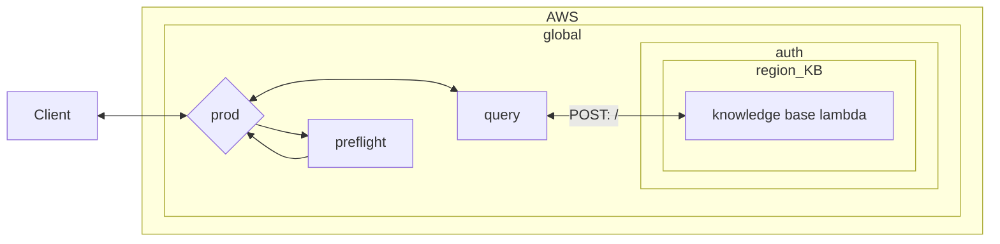

```mermaid
    flowchart LR

    Client <--> STAGE
    
    subgraph AWS
    subgraph global

        STAGE{prod}

        PREFLIGHT[preflight]
        
        STAGE --> PREFLIGHT
        PREFLIGHT --> STAGE

        STAGE <--> QUERY

        QUERY[query]

        PREFLIGHT ~~~ QUERY

        QUERY <-- POST: / --> KB_LAMBDA

        subgraph auth
            subgraph region_KB
                KB_LAMBDA[knowledge base lambda]
            end
        end
        end
    end
```
